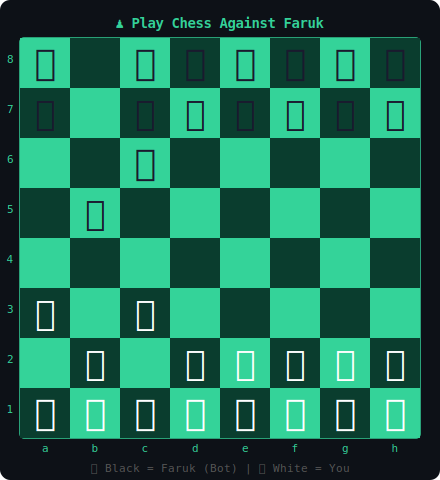
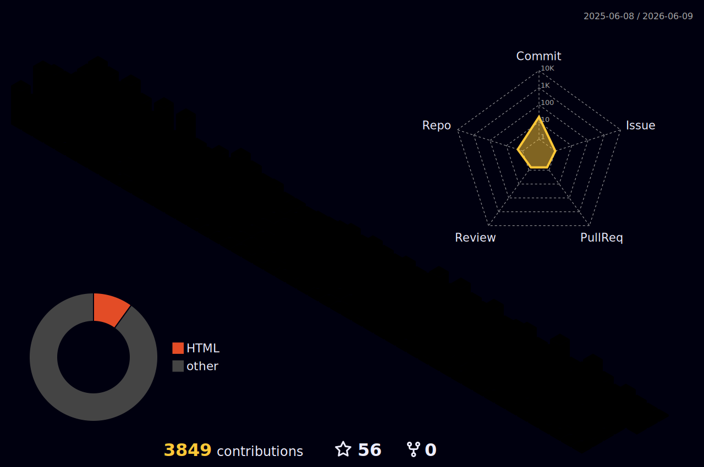

<div align="center">

[+%E2%9C%85;Building+scalable+products+since+2019+%F0%9F%9A%80;React+%7C+Node+%7C+MongoDB+%7C+Next.js+%F0%9F%94%A5;50%2B+web+apps+shipped+to+production+%F0%9F%93%A6;Team+Lead+%7C+Architect+%7C+Open+Source+%F0%9F%8C%90)](https://git.io/typing-svg)

[](https://docs.google.com/document/d/1sYASjLkzhbB9U566Eb-W007ww9culeCYNCjExRgEsbY/edit?usp=sharing)
[](https://portfolio-faruk.vercel.app/)
[](https://www.linkedin.com/in/faruk-shaikh-a5081a161)
[](https://github.com/Shaikhfaruk)
[](mailto:sfaruk1137@gmail.com)
[](https://www.youtube.com/@codecrushers-)


</div>

---

<table>
<tr>
<td valign="top" width="55%">

### `$ boot --profile faruk`

```bash
OS          : Developer v7.0 (Pune Edition)
Role        : Senior Team Lead — MERN Stack
Company     : EduNewron · ODM Educational Group
Experience  : 7+ years in full-stack development
Projects    : 50+ shipped · 18 live & deployed
Open Source : newron-ui (npm) · React component lib
Status      : 🟢 ONLINE — Available for contracts
Contract    : Web Dev · AI Strategy · UI/UX · Branding
```

```javascript
const faruk = {
  code:    ["JavaScript", "TypeScript", "Node.js"],
  stack:   ["React", "Next.js", "Express", "MongoDB"],
  cloud:   ["AWS", "DigitalOcean", "Vercel", "Docker"],
  passion: "Turning bold ideas → scalable products",
  fun_fact: "I debug in production (sometimes 😅)"
};
```

</td>
<td valign="top" align="center" width="45%">


</td>
</tr>
</table>

---

## `🎵 Now Playing`

> What I'm listening to right now on Spotify.

<div align="center">

[](https://github.com/kittinanx/spotify-github-profile)

</div>

---

## `♟️ Play Chess Against Me — Right Here`

> **This board is LIVE.** Click any move link below — it opens a pre-filled GitHub Issue. I have a bot that processes your move, updates the board automatically, and plays back. You're literally playing chess *inside* a GitHub README.

<div align="center">



</div>

<!-- CHESS-MOVES-START -->
**It's your turn! (You play as ⬜ White)**

| | a | b | c | d | e | f | g | h |
|---|---|---|---|---|---|---|---|---|
| **Open** | [a2→a3](https://github.com/Shaikhfaruk/Shaikhfaruk/issues/new?title=chess%3A+a2a3&body=Making+the+move+a2-a3.+Good+luck!&labels=chess) | [b2→b3](https://github.com/Shaikhfaruk/Shaikhfaruk/issues/new?title=chess%3A+b2b3&body=Making+the+move+b2-b3.+Good+luck!&labels=chess) | [c2→c3](https://github.com/Shaikhfaruk/Shaikhfaruk/issues/new?title=chess%3A+c2c3&body=Making+the+move+c2-c3.+Good+luck!&labels=chess) | [d2→d4](https://github.com/Shaikhfaruk/Shaikhfaruk/issues/new?title=chess%3A+d2d4&body=Making+the+move+d2-d4.+Good+luck!&labels=chess) | [e2→e4](https://github.com/Shaikhfaruk/Shaikhfaruk/issues/new?title=chess%3A+e2e4&body=Making+the+move+e2-e4.+Good+luck!&labels=chess) | [f2→f3](https://github.com/Shaikhfaruk/Shaikhfaruk/issues/new?title=chess%3A+f2f3&body=Making+the+move+f2-f3.+Good+luck!&labels=chess) | [g1→f3](https://github.com/Shaikhfaruk/Shaikhfaruk/issues/new?title=chess%3A+g1f3&body=Making+the+move+g1-f3.+Good+luck!&labels=chess) | [h2→h3](https://github.com/Shaikhfaruk/Shaikhfaruk/issues/new?title=chess%3A+h2h3&body=Making+the+move+h2-h3.+Good+luck!&labels=chess) |
<!-- CHESS-MOVES-END -->

> 🤖 Move processed by GitHub Actions bot. Game state lives in [`chess/game.pgn`](./chess/game.pgn). View [game history](./chess/history.md).

<details>
<summary>⚙️ Setup: Interactive Chess Game</summary>

**Step 1** — Create these files in your profile repo:

```
Shaikhfaruk/
├── chess/
│   ├── board.svg        ← auto-generated by action
│   ├── game.pgn         ← game state (start empty)
│   └── history.md       ← move log (start empty)
└── .github/
    └── workflows/
        └── chess.yml    ← see workflow below
```

**Step 2** — Create `.github/workflows/chess.yml`:

```yaml
name: Chess Game Bot

on:
  issues:
    types: [opened]

jobs:
  chess-move:
    if: startsWith(github.event.issue.title, 'chess:')
    runs-on: ubuntu-latest
    steps:
      - uses: actions/checkout@v3

      - name: Setup Node.js
        uses: actions/setup-node@v3
        with:
          node-version: '18'

      - name: Install chess.js
        run: npm install chess.js canvas

      - name: Process move & update board
        uses: actions/github-script@v6
        with:
          github-token: ${{ secrets.GITHUB_TOKEN }}
          script: |
            const { Chess } = require('chess.js');
            const fs = require('fs');
            const title = context.payload.issue.title;
            const move = title.replace('chess: ', '').trim();

            // Load current game
            let pgn = '';
            try { pgn = fs.readFileSync('chess/game.pgn', 'utf8'); } catch(e) {}
            const chess = new Chess();
            if (pgn) chess.loadPgn(pgn);

            // Make the move
            let result;
            try {
              result = chess.move({ from: move.slice(0,2), to: move.slice(2,4), promotion: 'q' });
            } catch(e) {
              await github.rest.issues.createComment({
                owner: context.repo.owner, repo: context.repo.repo,
                issue_number: context.payload.issue.number,
                body: `❌ Invalid move \`${move}\`. Please try a valid move!`
              });
              await github.rest.issues.update({
                owner: context.repo.owner, repo: context.repo.repo,
                issue_number: context.payload.issue.number,
                state: 'closed'
              });
              return;
            }

            // Auto-reply as black with random move
            const moves = chess.moves({ verbose: true });
            if (moves.length > 0) {
              const botMove = moves[Math.floor(Math.random() * moves.length)];
              chess.move(botMove);
            }

            // Save game state
            fs.writeFileSync('chess/game.pgn', chess.pgn());

            // Generate SVG board (basic Unicode representation)
            const boardSvg = generateBoardSvg(chess);
            fs.writeFileSync('chess/board.svg', boardSvg);

            // Append to history
            const historyEntry = `- **Move ${chess.history().length - 1}**: ${context.payload.issue.user.login} played \`${result.san}\`\n`;
            fs.appendFileSync('chess/history.md', historyEntry);

            // Close issue with success comment
            const player = context.payload.issue.user.login;
            await github.rest.issues.createComment({
              owner: context.repo.owner, repo: context.repo.repo,
              issue_number: context.payload.issue.number,
              body: `♟️ **@${player}** played \`${result.san}\`! Board updated. Check the README to see the new position!`
            });
            await github.rest.issues.update({
              owner: context.repo.owner, repo: context.repo.repo,
              issue_number: context.payload.issue.number,
              state: 'closed'
            });

            function generateBoardSvg(chess) {
              const board = chess.board();
              const pieceMap = {
                'p':'♟','r':'♜','n':'♞','b':'♝','q':'♛','k':'♚',
                'P':'♙','R':'♖','N':'♘','B':'♗','Q':'♕','K':'♔'
              };
              let svg = `<svg xmlns="http://www.w3.org/2000/svg" viewBox="0 0 400 400" width="400" height="400">`;
              svg += `<rect width="400" height="400" fill="#0d1117"/>`;
              board.forEach((row, ri) => {
                row.forEach((sq, ci) => {
                  const light = (ri + ci) % 2 === 0;
                  svg += `<rect x="${ci*50}" y="${ri*50}" width="50" height="50" fill="${light ? '#34D399' : '#0a3d2e'}"/>`;
                  if (sq) {
                    const p = sq.color === 'w' ? sq.type.toUpperCase() : sq.type;
                    svg += `<text x="${ci*50+25}" y="${ri*50+35}" font-size="32" text-anchor="middle" fill="${sq.color==='w'?'#ffffff':'#0d1117'}">${pieceMap[p]||''}</text>`;
                  }
                });
              });
              svg += `</svg>`;
              return svg;
            }

      - name: Commit updated board
        run: |
          git config user.name "Chess Bot 🤖"
          git config user.email "chess-bot@users.noreply.github.com"
          git add chess/
          git commit -m "♟️ Chess: board updated after move" || exit 0
          git push
```

**Step 3** — Create the `chess` label in your repo:  
Go to `Issues → Labels → New Label` → name it `chess`, color `#34D399`.

That's it! Every visitor who clicks a move link will trigger the bot. 🎉

</details>

---


## `🌐 3D Contribution Globe`

> My entire contribution history rendered as a 3D spinning globe.

<div align="center">



</div>

---

## `🐍 Watch the Snake Eat My Contributions`

<div align="center">


</div>

<details>
---

## `📡 Skill Proficiency Matrix`

```
──────────────────────────────────────────────────────────────
 SKILL                              PROFICIENCY
──────────────────────────────────────────────────────────────
 JavaScript     ████████████████████  ∞  Expert (7+ yrs)
 TypeScript     ██████████████████░░  90%  Advanced
 React.js       ████████████████████  ∞  Expert (6+ yrs)
 Next.js        ████████████████████  ∞  Expert
 Node.js        ██████████████████░░  90%  Advanced
 Express.js     ███████████████████░  95%  Expert
 MongoDB        ██████████████████░░  90%  Advanced
 Tailwind CSS   ████████████████████  ∞  Expert
 GraphQL        ████████████████░░░░  80%  Proficient
 Docker         ████████████████░░░░  80%  Proficient
 AWS            ██████████████░░░░░░  70%  Intermediate
──────────────────────────────────────────────────────────────
```

---

## `🏆 Trophy Case`

<div align="center">

[](https://github.com/ryo-ma/github-profile-trophy)

</div>

---

## `📊 GitHub Analytics`

<div align="center">


[](https://github.com/ashutosh00710/github-readme-activity-graph)

</div>

---

## `🚀 Featured Projects`

<table>
<tr>
<td width="33%" valign="top">

### 🎓 EduNewron
```
Stack  → React · Tailwind · Node · MongoDB
Scale  → Multi-institution architecture
Live   → Real-time updates & analytics
```
[](https://school.elern.io/#team)

</td>
<td width="33%" valign="top">

### 📋 Pitchspot
```
Stack  → Next.js · Express · Socket.io
Plus   → Editor.js · Real-time collab
Test   → Cypress automated testing
```
[](https://app.pitchspot.io/)

</td>
<td width="33%" valign="top">

### 🌐 MYTY
```
Stack  → Next.js · Node · MongoDB
Plus   → Socket.io · Real-time notifs
UX     → Fully responsive & custom
```
[](https://mytym.in/)

</td>
</tr>
</table>

---

## `🛠️ Full Tech Arsenal`

<div align="center">

**Frontend**

      

**Styling & Design**

      

**Backend & Database**

      

**Testing & Quality**

    

**DevOps & Cloud**

     

**Tools**

     

</div>

---

## `📦 Open Source — newron-ui`

<div align="center">

[](https://www.npmjs.com/package/newron-ui)

</div>

> TypeScript-first React component library for educational platforms.

```bash
npm install newron-ui
```

```
✅  Atomic design principles       ✅  Theme customization
✅  Fully responsive & accessible  ✅  Comprehensive docs
✅  TypeScript-first               ✅  Seamless React integration
```

---

## `💼 Career Timeline`

```
2023 ──────────────────────────────────────────── PRESENT
│  🏢  Senior Team Lead — MERN Stack Developer
│       EduNewron (ODM Educational Group) · Pune
│       → Dev teams · Scalable architecture · Mentoring
│
2022 ─────────────────────────────────────── Jul 2023
│  💻  Full Stack MERN Developer
│       Coffeetobusiness (TechCream) · Indore
│       → E-commerce · SaaS · CI/CD · Agile
│
2021 ─────────────────────────────────────── Feb 2022
│  🎨  Frontend Developer
│       Criada · Indore
│       → React.js · UI/UX · Cross-functional
│
2019 ─────────────────────────────────────── Jul 2022
    🔨  Freelance Developer — Code Crushers · Remote
         → End-to-end delivery · 50+ projects shipped
```

---

## `🌐 18 Live Deployed Projects`

| # | Project | Description | Live |
|---|---|---|---|
| 01 | **Elern School CMS** | School Management Platform | [↗](https://school.elern.io/) |
| 02 | **SaathiBachat** | Advance Splitwise | [↗](https://saathibachat.com/) |
| 03 | **Code Crushers** | Developer Community | [↗](https://codecrushers.in/) |
| 04 | **Age Calculator** | Precision Age Tool | [↗](https://age-calculator-five-iota.vercel.app/) |
| 05 | **Unit Converter Plus** | Multi-unit Converter | [↗](https://unit-converter-plus.vercel.app/) |
| 06 | **Chinu Chat** | Real-time Messaging | [↗](https://chinu-chat.vercel.app/) |
| 07 | **Tulsi College** | Educational Institution Site | [↗](https://tulsicollege.vercel.app/) |
| 08 | **E-Commerce Store** | Modern Shopping Platform | [↗](https://shop-ecru.vercel.app/) |
| 09 | **Interactive Dashboard** | Data Visualization | [↗](https://csb-09ipw.vercel.app/) |
| 10 | **TikTok Counter** | Social Metrics Tracker | [↗](https://tiktok-counter.vercel.app/) |
| 11 | **Escribelo** | Writing Platform | [↗](https://escribelo.vercel.app/) |
| 12 | **TIA Web** | Web Application | [↗](https://ti-a-web.vercel.app/) |
| 13 | **Loothereum** | Blockchain Platform | [↗](https://loothereum.vercel.app/) |
| 14 | **Zuriets** | Web Application | [↗](https://zuriets.vercel.app/) |
| 15 | **GCC Club** | Community Platform | [↗](https://gccclub.vercel.app/) |
| 16 | **PS Global TV Client** | Streaming — Client | [↗](https://ps-global-tv-client.vercel.app/) |
| 17 | **PS Global TV Admin** | Streaming — Admin | [↗](https://ps-global-tv-admin.vercel.app/login) |
| 18 | **Ludo Game** | Classic Board Game | [↗](https://ludo-frontend-ashy.vercel.app/) |

---

## `🎓 Education & Languages`

```
🎓  B.C.S — Dr. Babasaheb Ambedkar Marathwada University  (2021–2024)
🗣️  English → Professional  ·  Hindi → Native  ·  Marathi → Native
```

## `🔗 Second GitHub Account`

[](https://github.com/shaikhfaruknewron)

---

<div align="center">

```
╔════════════════════════════════════════════════════════════╗
║   Thanks for visiting! If something helped you,           ║
║   drop a ⭐ — it means the world.                         ║
║                                                            ║
║   sfaruk1137@gmail.com  ·  portfolio-faruk.vercel.app     ║
╚════════════════════════════════════════════════════════════╝
```


</div>
